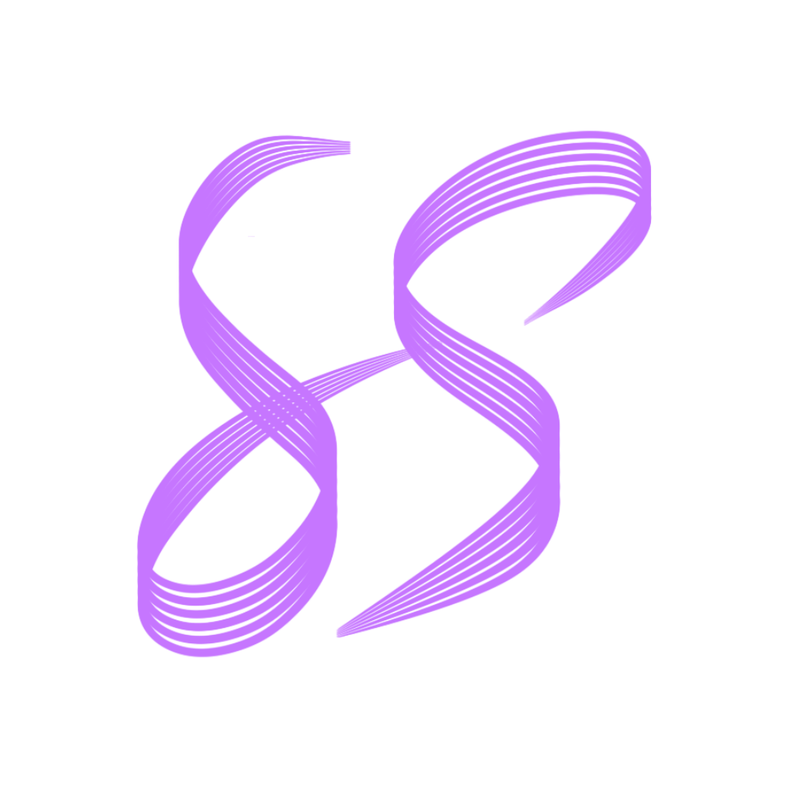
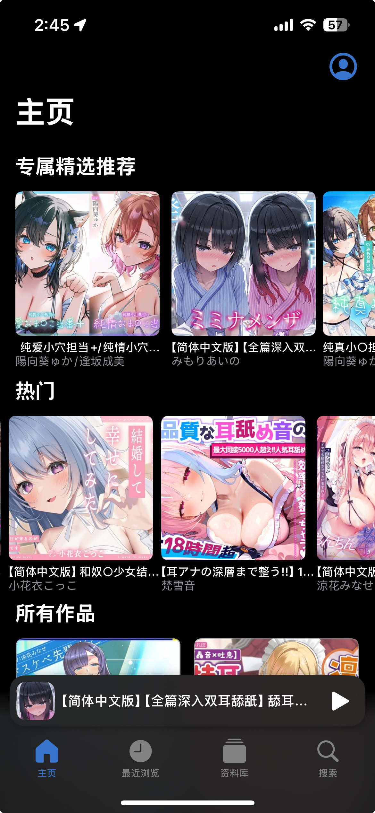
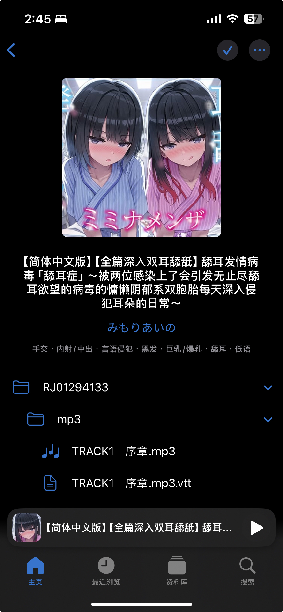
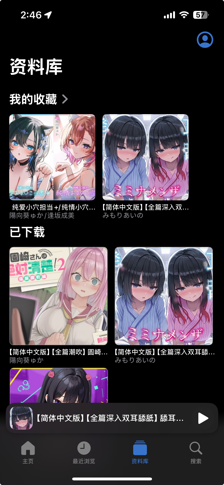

# Hydrate

来听听 ASMR 吧！

    

Hydrate 是 iOS 端的 ASMR 音频浏览及播放器，内容来自 [asmr.one](https://asmr.one)。

App 采用类似 Apple Music 的 UI 设计，并支持滚动字幕，助你在听音声时拥有更加“原生”的体验。

    
    
    
    

## 构建

1. Clone 项目，打开 `xcodeproj` 文件；
2. 等待软件包依赖项处理完成；
3. 转到文件浏览边栏 → Xcode 项目（Hydrate）→ TARGETS → Hydrate → Signing & Capabilities，将团队更改为你自己的，并修改一个不冲突的包标识符；
4. 构建 App。

## Disclaimer

Hydrate 用于学习 Swift 以及 SwiftUI 开发以及供个人、非商业性地使用，内容版权属于 [asmr.one](https://asmr.one) 或音声原发布平台以及音声作者本人。
